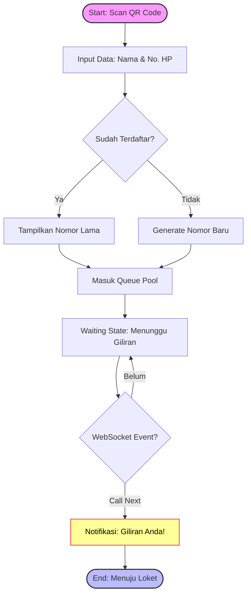
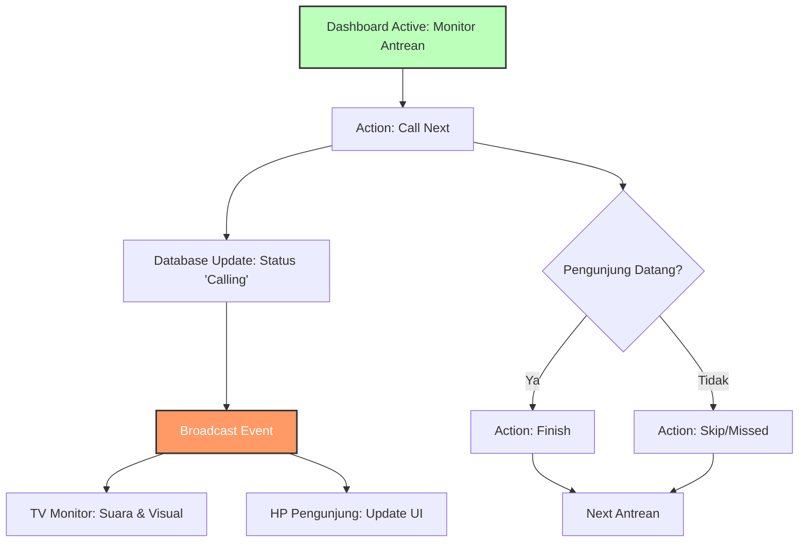

# 🚀 Avery PHP - Sistem Antrean & Booking Real-time

Selamat datang di **Avery PHP**, sebuah framework PHP Native minimalis yang dirancang khusus untuk menangani sistem antrean dan pemesanan ruangan secara **real-time**. Proyek ini dioptimalkan untuk berjalan di lingkungan **Devilbox** dengan struktur modern.

## 📋 Daftar Isi

- [🚀 Avery PHP - Sistem Antrean \& Booking Real-time](#-avery-php---sistem-antrean--booking-real-time)
  - [📋 Daftar Isi](#-daftar-isi)
  - [✨ Fitur Utama](#-fitur-utama)
  - [🔄 Alur Aplikasi](#-alur-aplikasi)
    - [1. Flowchart Pengunjung (Client Side)](#1-flowchart-pengunjung-client-side)
    - [2. Flowchart Admin (Server Side)](#2-flowchart-admin-server-side)
    - [3. Sinkronisasi Real-time (Behind the Scenes)](#3-sinkronisasi-real-time-behind-the-scenes)
  - [📂 Struktur Folder (Devilbox Ready)](#-struktur-folder-devilbox-ready)
  - [🛠️ Teknologi](#️-teknologi)

---

## ✨ Fitur Utama

- **Zero Dependency**: Core framework ditulis native tanpa library berat.
- **Real-time Updates**: Notifikasi instan menggunakan teknologi WebSocket/PubSub.
- **QR Code Access**: Pengunjung dapat bergabung ke antrean hanya dengan memindai QR.
- **Admin Dashboard**: Panel kontrol untuk memanggil dan mengelola antrean.
- **Database Migrations**: Manajemen skema database yang terstruktur.

---

## 🔄 Alur Aplikasi

Sistem ini memisahkan logika antara **Pengunjung (Client)** dan **Admin (Server)** untuk memastikan efisiensi dan pengalaman pengguna yang mulus.

### 1. Flowchart Pengunjung (Client Side)

_Perjalanan pengunjung dari mulai datang hingga dipanggil._



**Penjelasan:**

1.  **Akses**: Pengunjung memindai QR Code.
2.  **Validasi**: Sistem mengecek apakah data pengunjung sudah ada. Jika ya, nomor lama dipulihkan; jika tidak, nomor baru dibuat.
3.  **Menunggu**: Pengunjung melihat status antrean di layar HP ("Nomor Anda: 05 | Antrean Sekarang: 02").
4.  **Notifikasi**: Saat Admin memanggil, tampilan di HP pengunjung otomatis berubah tanpa refresh.

### 2. Flowchart Admin (Server Side)

_Logika di balik layar bagaimana petugas mengelola arus antrean._



**Penjelasan:**

1.  **Dashboard**: Admin memantau daftar antrean masuk.
2.  **Call Next**: Admin menekan tombol panggil.
3.  **Broadcast**: Server mengirim sinyal ke TV Monitor dan HP Pengunjung secara bersamaan.
4.  **Penyelesaian**: Admin menandai antrean sebagai "Selesai" atau "Hangus".

### 3. Sinkronisasi Real-time (Behind the Scenes)

Agar tidak perlu melakukan _refresh_ halaman berulang kali, sistem menggunakan pola **Pub/Sub (Publish-Subscribe)**:

- **📢 Publish**: Saat Admin klik "Next", backend mengirim pesan ke satu saluran (_Channel_) khusus.
- **👂 Subscribe**: Semua HP pengunjung dan TV Monitor "mendengarkan" saluran tersebut.
- **⚡ Result**: Begitu ada pesan masuk, UI pada ribuan perangkat yang terhubung akan berubah seketika secara serentak.

---

## 📂 Struktur Folder (Devilbox Ready)

```
htdocs/                  # Document Root
├── .env                 # Konfigurasi Environment
├── index.php            # Entry Point
├── app/                 # Core Logic (MVC)
│   ├── src/             # Controllers, Models, Helpers
│   └── templates/       # Views (HTML/PHP)
├── assets/              # CSS, JS, Images
└── bin/                 # CLI Tools (Migrations)
```

## 🛠️ Teknologi

- **Bahasa**: PHP Native 8.x
- **Database**: MySQL / MariaDB
- **Server**: Nginx / Apache (via Devilbox)
- **Frontend**: HTML5, CSS3, JavaScript (WebSocket Client)

---

_Dibuat dengan ❤️ untuk efisiensi antrean._
